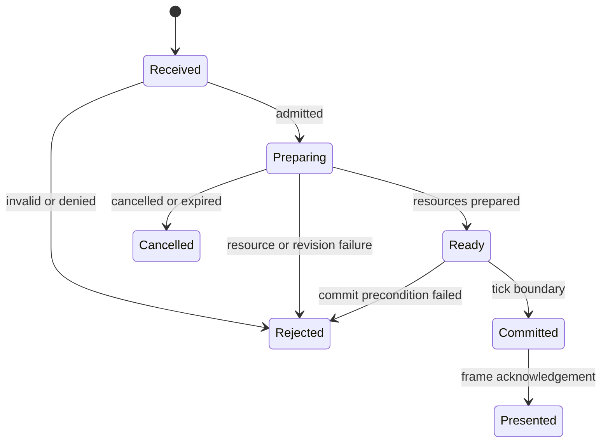

# AI control protocol

Status: proposed v0.1 contract. JSON examples describe the intended API; no server or SDK exists yet.

## Control loop

`observe -> propose -> validate -> prepare -> revalidate -> commit -> receipt -> observe`

An observation is a bounded snapshot with a world revision, simulation tick, resource revisions and capability-filtered content. A proposal is a typed batch, never a string of code to evaluate. Asset references must resolve to validated, permitted blobs. Validation checks authorization, schema, preconditions, finite numeric values, resource estimates and representation invariants before any mutation becomes visible.

Preparation builds any required derived resources. It is cancellable and carries the source revisions. At a simulation boundary the coordinator rechecks preconditions, installs the complete authoritative change and publishes a receipt. The renderer may present that revision on a later frame; clients can wait for presentation separately.

## Example transaction

```json
{
  "protocol_version": "0.1",
  "world_id": "workshop",
  "transaction_id": "018f7242-4387-7c98-a114-67787915a369",
  "idempotency": {"epoch": "server-issued-session-epoch", "sequence": 8},
  "expected_world_revision": 42,
  "apply_at": {"mode": "next_tick", "expires_after_ticks": 120},
  "budget": {"max_operations": 2, "max_blob_bytes": 0},
  "operations": [
    {"type": "entity.create", "temporary_id": "block", "prefab": "builtin.unit_cube"},
    {"type": "transform.set", "target": {"temporary_id": "block"},
     "position_m": [0.0, 2.0, 0.0], "rotation_xyzw": [0.0, 0.0, 0.0, 1.0],
     "scale": [1.0, 1.0, 1.0]}
  ]
}
```

The authenticated session determines the principal; a JSON `principal` field cannot impersonate another identity. In this initial authoring mode, an intervening authoring revision rejects the proposal; ordinary physics ticks do not. Later resource-scoped preconditions improve concurrency. Continuous physical actions use a bounded tick acceptance window, body generation and authored-configuration version. Observations expose authoring revision, simulation tick and snapshot sequence separately.

## Intended endpoints and errors

| Interface | Contract |
| --- | --- |
| `GET /v0/capabilities` | Protocol negotiation, allowed operations and effective limits |
| `POST /v0/observe` | Filtered query, bounded result, pagination/resync token |
| `POST /v0/transactions` | Validate and enqueue once; return transaction ID and current status |
| `GET /v0/transactions/{id}` | Durable status/receipt within the documented retention period |
| `POST /v0/transactions/{id}/cancel` | Cancel queued/preparing work; report too-late for committed work |
| `POST /v0/blobs` | Stream a bounded asset, verify hash, quarantine before validation |
| `GET /v0/events` | Bounded event stream with sequence numbers and explicit resync |

Typed errors include `UNSUPPORTED_VERSION`, `INVALID_SCHEMA`, `NONFINITE_VALUE`, `NOT_AUTHORIZED`, `NOT_FOUND`, `STALE_HANDLE`, `REVISION_CONFLICT`, `BUDGET_EXCEEDED`, `QUEUE_FULL`, `PREPARATION_FAILED`, `DEADLINE_EXPIRED`, `CANCELLED`, `IDEMPOTENCY_MISMATCH`, `REQUIRES_RESYNC`, and `UNSUPPORTED_OPERATION`. Error payloads identify the failing operation/path without leaking inaccessible objects or credentials. Unknown operation types are rejected, not ignored.

## State machine and atomicity



`Committed` is the terminal authoritative result; `Presented` is an optional additional observation and is not required in headless mode. A transaction cannot report committed and later silently revert due to a failed GPU upload. For edits that require rendering/collision resources, prepare them before commit or retain the old published pair until ready. Device loss after commit is a renderer-recovery problem and must not erase authoritative world data.

Durability is a separate receipt field: `durability: volatile|durable`, with a durable sequence/revision watermark. `Committed` means visible in memory, not crash persistence. `Presented` does not imply durability. Headless operation stages canonical data and any required collision resources without GPU work; graphical sessions additionally prepare the presentation pair. Attaching/recovering a renderer reconstructs it from committed snapshots.

One initial batch succeeds completely or does nothing. Large world-building jobs are explicit multi-batch plans with checkpoints and progress. They are not advertised as atomic across all batches. Failed preparation frees staged resources after relevant worker/GPU fences; admission charges cannot leak after repeated failures.

## Ordering, retries and durability

- The coordinator assigns an accepted sequence number and records the scheduled tick. Replay consumes this order, not nondeterministic client arrival timing.
- The idempotency key is `(world, authenticated principal, server-issued epoch, client sequence)`. The UUID `transaction_id` is a correlation ID, not the deduplication mechanism. Sequence numbers are monotonically admitted per epoch; the SDK serializes admissions, retries uncertain admissions with the same sequence, and resyncs on a gap. Completion may remain asynchronous.
- Reusing a retained sequence with a different payload is an error; the same payload returns its status/receipt. Store an admission high-water mark and compacted low-water mark, so a sequence at or below the admitted mark with no retained receipt is rejected as `REQUIRES_RESYNC`, never treated as new.
- Retain at most a configured window of receipts/payload hashes per epoch (initial target 10,000), bounded global principal/epoch counts and disk quotas. Rotation invalidates the old epoch; only server-issued active epochs are accepted. Negotiate actual limits at connection time. Persist epoch/watermarks with durable records.
- A key outside the active epoch or below the retained window returns `REQUIRES_RESYNC`; clients query current world state instead of assuming a mutation did not happen. They must not reissue an uncertain operation under a new epoch/sequence without reconciling its effect.
- Persist accepted ordering and committed receipts in the journal once persistence is delivered. Before that milestone, restart invalidates all epochs and clients must resync; do not claim crash-safe exactly-once behavior early.
- Cancel means “prevent commit if still possible.” Committed operations require a new compensating authoring command, not a fictitious cancellation.

Disk quotas bound journal retention. Checkpoint and compact only entries no longer needed by active replay/undo/branch references. If quota is exhausted, reject new durable authoring edits with an actionable error; never silently drop the recovery record.

For `await_durable` authoring requests, reserve journal space before commit, persist/flush referenced immutable blobs, append and flush the commit record with resolved IDs and retry metadata, then acknowledge the durable watermark. Normal fixed ticks need not wait on disk; durability work can lag in a bounded queue and expose its watermark. A durable acknowledgement survives immediate process termination; a volatile commit may be rolled back to the durable prefix after a crash. Failure after in-memory commit but before durable flush reports a durability error and retains queryable volatile status; it cannot claim the edit never occurred. Restart recovery reconstructs durable receipts and epoch watermarks before admitting retries, making unacknowledged durable edits discoverable. Epoch rotation on unsupported recovery requires explicit resync.

The recovery example injects crashes before blob flush, before/after journal flush, immediately before/after response delivery and during checkpoint replacement/compaction. “Durable” covers the documented filesystem flush/process-crash model; arbitrary hardware failure requires separate storage guarantees.

## Capabilities and initial quotas

Grants bind a principal to worlds, entity sets/regions, operation classes, observation fields, expiration and resource limits. A world tag saying `owner=agentA` is not an authorization check. Grants come from the host/editor, never from model output. Engine policies override smaller/larger budgets declared by clients.

Initial limits below are conservative configuration defaults to benchmark in PR-007; they are not throughput claims:

| Resource | Initial default |
| --- | --- |
| JSON control envelope | 1 MiB; nesting depth 32 |
| Operations per authoring transaction | 256 |
| In-flight transactions | 4 per principal; 64 globally |
| Single blob upload | 16 MiB, streamed and hashed |
| Voxel cells edited per transaction | 262,144, also subject to allocation budget |
| Mesh vertices edited per transaction | 65,536; topology separately bounded |
| Observation payload | 4 MiB; images only when requested |
| Image write | 4 MiB per batch; format/dimensions validated |
| Agent/provider deadline | 30 seconds by default, separate from frame timing |
| World CPU/GPU memory | Configured at world creation and reported in capabilities |

Quotas cover resulting allocation, decompressed size, derived jobs, GPU dispatch dimensions and observation egress, not just input byte count. Continuous rate limits and fair scheduling prevent one agent from filling every queue. Essential simulation work has priority over authoring jobs.

## Provider and SDK behavior

The Python SDK exposes typed queries, transaction building, status polling, bounded retries and event resync. It negotiates protocol version and surfaces structured errors. Generated SDK models should come from the authoritative command schema once PR-002 creates it.

A provider adapter returns a proposal plus optional explanation. It cannot commit by bypassing the gateway. The mandatory provider is deterministic scripted logic using local procedural fixtures. Optional live-model adapters add provider/model identification, timeouts, cost ceilings, redacted telemetry and schema validation. Record accepted actions for replay; do not rerun a language model and claim the new output is a reproduction.

An out-of-process Python provider is a crash boundary, **not an OS sandbox**. Trusted local scripts retain their OS permissions. Downloaded or adversarial code requires actual process/container restrictions and a separately reviewed execution service. Never automatically execute generated shell, Python, shaders or native plugins as part of plan interpretation.

## Observation and planning design

Prefer semantic queries, bounding boxes, raycasts and small image regions over repeated full-resolution screenshots. Include uncertainty and stale-data markers where results derive from previous ticks. For goal-directed world building, use a catalog of typed operations and a plan of bounded steps; show estimated cost, touched regions and destructive edits before dispatch.

Prompt injection in labels, imported descriptions or provider responses is treated as untrusted content. Only the host grants permissions. Agent evaluations separately measure task success, invalid-command rate, recovery, latency, observation bytes and provider cost. Core engine tests do not depend on a live model's language quality.
