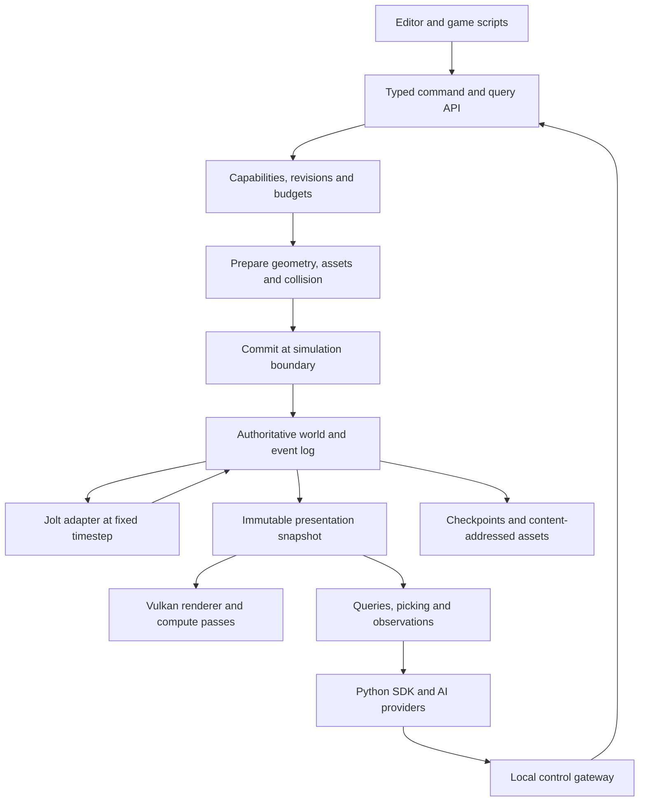

# Architecture

Status: proposed. Nothing in this document implies implemented capabilities.

## Runtime shape

Omniweft is a native engine with a headless mode, a desktop editor and external agent clients. The core world is independent of a graphics driver or model runtime.

AI reasoning runs outside the simulation thread. The editor and gateway submit commands; they do not acquire arbitrary mutable world pointers. Long preparation jobs run on bounded worker queues and publish results only after revisions are revalidated.

## Proposed stack

| Area | Choice | Rationale and qualification |
| --- | --- | --- |
| Runtime | C++20 | Direct access to native graphics/physics tooling; central ownership and sanitizers mitigate memory risks |
| Build | CMake + Ninja; checked-in presets | Common Windows/Linux workflow; exact versions and dependency lock established by PR-001 |
| Platform | SDL3 | Window, events, input and platform integration; supported-platform evidence in [SDL documentation](https://wiki.libsdl.org/SDL3/README-platforms) |
| GPU | Vulkan 1.3 baseline + bounded compute | One renderer across target systems; startup probes required features/limits before device creation |
| Physics | Jolt behind `ow_physics` | Reuse mature rigid-body solver while retaining engine IDs and mutation rules; [upstream architecture](https://jrouwe.github.io/JoltPhysics/) |
| SDK | Python 3.11+ over local versioned IPC | Familiar agent integration without embedding Python in the frame loop |
| Imports | glTF 2.0/GLB first | Standard mesh/material interchange; native world semantics use a separate format |
| Editor | Dear ImGui adapter, subject to build spike | Fast developer inspector and timeline; accessibility gaps tracked explicitly |
| Model runtime | Optional ONNX Runtime CPU adapter later | Isolated dependency; accelerator/provider compatibility requires separate testing |
| Tests | CTest + a pinned C++ test library selected in PR-001 | Headless test executables, example harness, regression artifacts |

Dependency versions are not selected by floating branch at configure time. PR-001 records exact source revisions, licenses, checksums, build options and supported compilers. The design chooses libraries, not an untested lockfile.

## Dependency boundaries

| Module | Owns | May depend on |
| --- | --- | --- |
| `ow_foundation` | IDs, math conventions, errors, clocks, jobs, bounded allocators | C++ standard library and audited tiny utilities |
| `ow_world` | Entity/component storage, revisions, sparse volumes, image and mesh metadata | foundation |
| `ow_commands` | Versioned schemas, authorization, transactions, receipts | world, foundation |
| `ow_assets` | Hash-addressed blobs, import validation, provenance, cooking | foundation, world schema |
| `ow_simulation` | Tick ordering, state transitions, controller fallback | commands, world |
| `ow_physics` | Solver handles, body/constraint caches, collision cooking | simulation contracts, Jolt |
| `ow_geometry` | Mesh/voxel operations, extraction, derived geometry | world, assets, jobs |
| `ow_render` | Render graph, GPU resources, material compilation, readback | presentation schema, assets, SDL/Vulkan adapters |
| `ow_control` | Local session authentication, protocol framing, subscriptions | commands and read-only snapshot API |
| `ow_editor` | Inspector, preview, diff, operation history, viewport | public engine interfaces, UI adapter |
| `ow_sdk_python` | Typed client, retry/status and provider adapter interfaces | protocol schema; no engine shared-memory access |

Arrows in this table mean build dependencies. Foundation must not depend on platform or renderer. The world/commands tests must build without SDL, Vulkan, Jolt, Python or an AI provider. Physics feeds explicit state updates back through simulation ownership; it cannot become a second independent entity database.

## Execution and ownership

- Simulation owns mutable committed state on one coordinator thread initially. Parallel systems must declare read/write sets and stable merge order before being enabled.
- CPU workers import assets, prepare mesh buffers, extract voxel surfaces and cook supported collision shapes. Queue entries carry cancellation, size and revision metadata.
- Rendering consumes immutable snapshots and owns GPU submission. Resource retirement follows GPU fences; deletion never frees in-flight memory.
- The control gateway owns client I/O and bounded observation queues. Slow subscribers lose old deltas and receive a resync request, rather than blocking simulation.
- Provider processes own model execution. They receive explicit observations and cannot enumerate local project files by default.

The initial local transport is loopback HTTP with JSON control envelopes and bounded binary blob uploads. It binds only to loopback, uses a fresh per-session bearer token, rejects browser origins by default, has no ambient cookie authentication, and never logs credentials. Remote binding and TLS are a later feature requiring an explicit deployment design. Named pipes/Unix sockets can replace the transport behind the same protocol if profiling justifies them.

## Coordinates and scale

Use a right-handed world, +Y up, meters, kilograms, seconds and radians. Document camera forward separately as local -Z and normalize imported asset orientation at the import boundary. glTF asset orientation is defined in the [glTF specification](https://registry.khronos.org/glTF/specs/2.0/glTF-2.0.html). Store persistent placement as an integer region coordinate plus local coordinates so large-world rebasing can be added without redefining entity identity. v0.1 tests a bounded local world; it does not claim large-world precision.

## Packaging and extension

Ship a headless runner, editor, versioned SDK, offline examples and notices. Keep the public control schema separate from internal C++ layout. A stable native plugin ABI is deferred; in-process C++ plugins are trusted code, not sandboxed extensions. Later untrusted procedural extensions should execute out of process or in a resource-limited WASM runtime.

The [ADRs](adr/README.md) record alternatives: Rust for a safer core, wgpu for a different rendering abstraction, embedding an existing engine, and an initial voxel-only world. Revisit a choice if build spikes fail, maintenance cost grows or actual profiling contradicts it.
